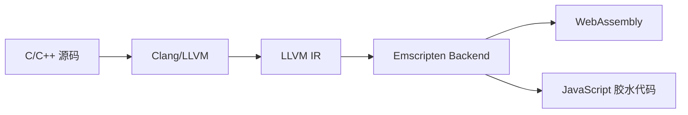

# 第8章 从 C/C++ 编译

C/C++ 是编译到 WebAssembly 的主要语言之一，通过 Emscripten 工具链可以将现有的 C/C++ 代码高效地转换为 WebAssembly。本章将详细介绍 C/C++ 到 WebAssembly 的编译流程、优化技巧和实践案例。

## 8.1 Emscripten 工具链

### 8.1.1 Emscripten 简介

Emscripten 是一个完整的工具链，用于将 C/C++ 代码编译为 WebAssembly：

**核心组件**：
- **emcc**: C 编译器（基于 Clang）
- **em++**: C++ 编译器（基于 Clang++）
- **emsdk**: Emscripten SDK 管理器
- **emcmake**: CMake 包装器
- **emmake**: Make 包装器

**编译流程**：


### 8.1.2 环境配置

**安装 Emscripten**：
```bash
# 下载 emsdk
git clone https://github.com/emscripten-core/emsdk.git
cd emsdk

# 安装最新稳定版
./emsdk install latest
./emsdk activate latest

# 设置环境变量
source ./emsdk_env.sh
```

**验证安装**：
```bash
# 检查版本
emcc --version
em++ --version

# 测试编译
echo 'int main() { return 42; }' > test.c
emcc test.c -o test.html
```

### 8.1.3 基本编译命令

**简单编译**：
```bash
# 编译为 HTML + WASM
emcc hello.c -o hello.html

# 仅编译为 WASM + JS
emcc hello.c -o hello.js

# 编译为纯 WASM
emcc hello.c -o hello.wasm --no-entry
```

**常用编译选项**：
```bash
# 优化等级
emcc hello.c -O3 -o hello.js          # 最高优化
emcc hello.c -Os -o hello.js          # 体积优化
emcc hello.c -Oz -o hello.js          # 极致体积优化

# 调试模式
emcc hello.c -g -O0 -o hello.js       # 调试模式
emcc hello.c -gsource-map -o hello.js # 生成源码映射

# 内存设置
emcc hello.c -s INITIAL_MEMORY=64MB -o hello.js
emcc hello.c -s ALLOW_MEMORY_GROWTH=1 -o hello.js
```

## 8.2 基础编译示例

### 8.2.1 Hello World 示例

**C 源码** (`hello.c`):
```c
#include <stdio.h>

int main() {
    printf("Hello, WebAssembly from C!\n");
    return 0;
}
```

**编译和运行**：
```bash
# 编译为 HTML 页面
emcc hello.c -o hello.html

# 在浏览器中打开 hello.html
# 或使用 Python 启动本地服务器
python3 -m http.server 8000
```

**生成的文件**：
- `hello.html`: 包含运行环境的 HTML 页面
- `hello.js`: JavaScript 胶水代码
- `hello.wasm`: WebAssembly 二进制文件

### 8.2.2 数学计算示例

**数学库** (`math_lib.c`):
```c
#include <math.h>
#include <emscripten.h>

// 使用 EMSCRIPTEN_KEEPALIVE 防止函数被优化掉
EMSCRIPTEN_KEEPALIVE
double calculate_circle_area(double radius) {
    return M_PI * radius * radius;
}

EMSCRIPTEN_KEEPALIVE
double calculate_factorial(int n) {
    if (n <= 1) return 1.0;
    double result = 1.0;
    for (int i = 2; i <= n; i++) {
        result *= i;
    }
    return result;
}

EMSCRIPTEN_KEEPALIVE
double calculate_fibonacci(int n) {
    if (n <= 1) return n;
    
    double a = 0, b = 1, temp;
    for (int i = 2; i <= n; i++) {
        temp = a + b;
        a = b;
        b = temp;
    }
    return b;
}

// 向量运算
EMSCRIPTEN_KEEPALIVE
void vector_add(float* a, float* b, float* result, int length) {
    for (int i = 0; i < length; i++) {
        result[i] = a[i] + b[i];
    }
}

EMSCRIPTEN_KEEPALIVE
float vector_dot_product(float* a, float* b, int length) {
    float sum = 0.0f;
    for (int i = 0; i < length; i++) {
        sum += a[i] * b[i];
    }
    return sum;
}
```

**编译数学库**：
```bash
emcc math_lib.c -o math_lib.js \
  -s EXPORTED_FUNCTIONS='["_calculate_circle_area","_calculate_factorial","_calculate_fibonacci","_vector_add","_vector_dot_product"]' \
  -s EXPORTED_RUNTIME_METHODS='["ccall","cwrap"]' \
  -O3
```

**JavaScript 调用**：
```javascript
// 加载 WebAssembly 模块
Module.onRuntimeInitialized = function() {
    // 包装 C 函数
    const calculateCircleArea = Module.cwrap('calculate_circle_area', 'number', ['number']);
    const calculateFactorial = Module.cwrap('calculate_factorial', 'number', ['number']);
    const calculateFibonacci = Module.cwrap('calculate_fibonacci', 'number', ['number']);
    
    // 调用函数
    console.log('Circle area (r=5):', calculateCircleArea(5));
    console.log('Factorial(10):', calculateFactorial(10));
    console.log('Fibonacci(20):', calculateFibonacci(20));
    
    // 向量运算示例
    const vectorAdd = Module.cwrap('vector_add', null, ['number', 'number', 'number', 'number']);
    const vectorDot = Module.cwrap('vector_dot_product', 'number', ['number', 'number', 'number']);
    
    // 分配内存
    const length = 4;
    const bytesPerFloat = 4;
    const ptr_a = Module._malloc(length * bytesPerFloat);
    const ptr_b = Module._malloc(length * bytesPerFloat);
    const ptr_result = Module._malloc(length * bytesPerFloat);
    
    // 创建 TypedArray 视图
    const a = new Float32Array(Module.HEAPF32.buffer, ptr_a, length);
    const b = new Float32Array(Module.HEAPF32.buffer, ptr_b, length);
    const result = new Float32Array(Module.HEAPF32.buffer, ptr_result, length);
    
    // 设置数据
    a.set([1, 2, 3, 4]);
    b.set([5, 6, 7, 8]);
    
    // 执行向量加法
    vectorAdd(ptr_a, ptr_b, ptr_result, length);
    console.log('Vector addition result:', Array.from(result));
    
    // 执行点积
    const dotProduct = vectorDot(ptr_a, ptr_b, length);
    console.log('Dot product:', dotProduct);
    
    // 释放内存
    Module._free(ptr_a);
    Module._free(ptr_b);
    Module._free(ptr_result);
};
```

### 8.2.3 C++ 类和对象示例

**C++ 类库** (`geometry.cpp`):
```cpp
#include <emscripten/bind.h>
#include <vector>
#include <cmath>

class Point {
public:
    Point(double x, double y) : x_(x), y_(y) {}
    
    double getX() const { return x_; }
    double getY() const { return y_; }
    void setX(double x) { x_ = x; }
    void setY(double y) { y_ = y; }
    
    double distanceTo(const Point& other) const {
        double dx = x_ - other.x_;
        double dy = y_ - other.y_;
        return std::sqrt(dx * dx + dy * dy);
    }
    
    Point add(const Point& other) const {
        return Point(x_ + other.x_, y_ + other.y_);
    }
    
private:
    double x_, y_;
};

class Circle {
public:
    Circle(const Point& center, double radius) 
        : center_(center), radius_(radius) {}
    
    double getArea() const {
        return M_PI * radius_ * radius_;
    }
    
    double getCircumference() const {
        return 2 * M_PI * radius_;
    }
    
    bool contains(const Point& point) const {
        return center_.distanceTo(point) <= radius_;
    }
    
    Point getCenter() const { return center_; }
    double getRadius() const { return radius_; }
    
private:
    Point center_;
    double radius_;
};

class Polygon {
public:
    void addPoint(const Point& point) {
        points_.push_back(point);
    }
    
    double getPerimeter() const {
        if (points_.size() < 2) return 0.0;
        
        double perimeter = 0.0;
        for (size_t i = 0; i < points_.size(); i++) {
            size_t next = (i + 1) % points_.size();
            perimeter += points_[i].distanceTo(points_[next]);
        }
        return perimeter;
    }
    
    size_t getPointCount() const {
        return points_.size();
    }
    
    Point getPoint(size_t index) const {
        if (index < points_.size()) {
            return points_[index];
        }
        return Point(0, 0); // 默认值
    }
    
private:
    std::vector<Point> points_;
};

// 使用 Embind 绑定 C++ 类到 JavaScript
using namespace emscripten;

EMSCRIPTEN_BINDINGS(geometry) {
    class_<Point>("Point")
        .constructor<double, double>()
        .property("x", &Point::getX, &Point::setX)
        .property("y", &Point::getY, &Point::setY)
        .function("distanceTo", &Point::distanceTo)
        .function("add", &Point::add);
    
    class_<Circle>("Circle")
        .constructor<const Point&, double>()
        .function("getArea", &Circle::getArea)
        .function("getCircumference", &Circle::getCircumference)
        .function("contains", &Circle::contains)
        .property("center", &Circle::getCenter)
        .property("radius", &Circle::getRadius);
    
    class_<Polygon>("Polygon")
        .constructor<>()
        .function("addPoint", &Polygon::addPoint)
        .function("getPerimeter", &Polygon::getPerimeter)
        .function("getPointCount", &Polygon::getPointCount)
        .function("getPoint", &Polygon::getPoint);
}
```

**编译 C++ 模块**：
```bash
em++ geometry.cpp -o geometry.js \
  --bind \
  -O3 \
  -s ALLOW_MEMORY_GROWTH=1 \
  -s MODULARIZE=1 \
  -s EXPORT_NAME="'GeometryModule'"
```

**JavaScript 使用**：
```javascript
GeometryModule().then(function(Module) {
    // 创建点对象
    const p1 = new Module.Point(0, 0);
    const p2 = new Module.Point(3, 4);
    
    console.log('Distance:', p1.distanceTo(p2)); // 5
    
    // 创建圆
    const center = new Module.Point(0, 0);
    const circle = new Module.Circle(center, 5);
    
    console.log('Circle area:', circle.getArea());
    console.log('Circle circumference:', circle.getCircumference());
    console.log('Contains p2:', circle.contains(p2));
    
    // 创建多边形
    const polygon = new Module.Polygon();
    polygon.addPoint(new Module.Point(0, 0));
    polygon.addPoint(new Module.Point(1, 0));
    polygon.addPoint(new Module.Point(1, 1));
    polygon.addPoint(new Module.Point(0, 1));
    
    console.log('Polygon perimeter:', polygon.getPerimeter()); // 4
    console.log('Point count:', polygon.getPointCount()); // 4
    
    // 清理内存
    p1.delete();
    p2.delete();
    center.delete();
    circle.delete();
    polygon.delete();
});
```

## 8.3 内存管理

### 8.3.1 内存分配和释放

**C 内存管理**：
```c
#include <stdlib.h>
#include <emscripten.h>

EMSCRIPTEN_KEEPALIVE
void* allocate_buffer(size_t size) {
    return malloc(size);
}

EMSCRIPTEN_KEEPALIVE
void free_buffer(void* ptr) {
    free(ptr);
}

EMSCRIPTEN_KEEPALIVE
void fill_buffer(int* buffer, int size, int value) {
    for (int i = 0; i < size; i++) {
        buffer[i] = value * i;
    }
}

EMSCRIPTEN_KEEPALIVE
int sum_buffer(int* buffer, int size) {
    int sum = 0;
    for (int i = 0; i < size; i++) {
        sum += buffer[i];
    }
    return sum;
}
```

**JavaScript 内存管理**：
```javascript
Module.onRuntimeInitialized = function() {
    const allocateBuffer = Module.cwrap('allocate_buffer', 'number', ['number']);
    const freeBuffer = Module.cwrap('free_buffer', null, ['number']);
    const fillBuffer = Module.cwrap('fill_buffer', null, ['number', 'number', 'number']);
    const sumBuffer = Module.cwrap('sum_buffer', 'number', ['number', 'number']);
    
    // 分配内存
    const size = 1000;
    const bytesPerInt = 4;
    const bufferPtr = allocateBuffer(size * bytesPerInt);
    
    if (bufferPtr === 0) {
        console.error('Memory allocation failed');
        return;
    }
    
    try {
        // 创建 TypedArray 视图
        const buffer = new Int32Array(Module.HEAP32.buffer, bufferPtr, size);
        
        // 填充数据
        fillBuffer(bufferPtr, size, 10);
        
        // 验证数据
        console.log('First 10 elements:', Array.from(buffer.slice(0, 10)));
        
        // 计算总和
        const total = sumBuffer(bufferPtr, size);
        console.log('Sum:', total);
        
        // JavaScript 端操作
        for (let i = 0; i < Math.min(size, 10); i++) {
            buffer[i] *= 2; // 直接修改内存
        }
        
        console.log('Modified first 10:', Array.from(buffer.slice(0, 10)));
        
    } finally {
        // 释放内存
        freeBuffer(bufferPtr);
    }
};
```

### 8.3.2 内存布局和优化

**内存配置选项**：
```bash
# 设置初始内存大小
emcc code.c -s INITIAL_MEMORY=134217728 -o output.js  # 128MB

# 允许内存增长
emcc code.c -s ALLOW_MEMORY_GROWTH=1 -o output.js

# 设置最大内存
emcc code.c -s MAXIMUM_MEMORY=268435456 -o output.js  # 256MB

# 使用 64KB 页面
emcc code.c -s WASM_MEM_MAX=65536 -o output.js
```

**内存对齐和优化**：
```c
#include <stdalign.h>
#include <emmintrin.h>  // SSE2 intrinsics

// 内存对齐的结构体
typedef struct {
    alignas(16) float data[4];  // 16字节对齐
    int count;
    char padding[12];  // 手动填充到32字节
} AlignedVector;

EMSCRIPTEN_KEEPALIVE
void process_aligned_vectors(AlignedVector* vectors, int count) {
    for (int i = 0; i < count; i++) {
        // 使用 SIMD 指令优化
        __m128 vec = _mm_load_ps(vectors[i].data);
        vec = _mm_mul_ps(vec, _mm_set1_ps(2.0f));
        _mm_store_ps(vectors[i].data, vec);
    }
}

// 缓存友好的数据访问
EMSCRIPTEN_KEEPALIVE
void cache_friendly_sum(float* matrix, int rows, int cols, float* result) {
    for (int i = 0; i < rows; i++) {
        float sum = 0.0f;
        for (int j = 0; j < cols; j++) {
            sum += matrix[i * cols + j];  // 行优先访问
        }
        result[i] = sum;
    }
}
```

### 8.3.3 垃圾回收和资源管理

**RAII 风格的资源管理**：
```cpp
#include <memory>
#include <emscripten/bind.h>

class ResourceManager {
public:
    ResourceManager(size_t size) : size_(size) {
        data_ = std::make_unique<float[]>(size);
        std::fill(data_.get(), data_.get() + size, 0.0f);
    }
    
    ~ResourceManager() {
        // std::unique_ptr 自动清理
    }
    
    void setData(size_t index, float value) {
        if (index < size_) {
            data_[index] = value;
        }
    }
    
    float getData(size_t index) const {
        return (index < size_) ? data_[index] : 0.0f;
    }
    
    size_t getSize() const { return size_; }
    
    // 批量操作
    void transform(float multiplier) {
        for (size_t i = 0; i < size_; i++) {
            data_[i] *= multiplier;
        }
    }
    
    float sum() const {
        float total = 0.0f;
        for (size_t i = 0; i < size_; i++) {
            total += data_[i];
        }
        return total;
    }
    
private:
    std::unique_ptr<float[]> data_;
    size_t size_;
};

EMSCRIPTEN_BINDINGS(resource_manager) {
    class_<ResourceManager>("ResourceManager")
        .constructor<size_t>()
        .function("setData", &ResourceManager::setData)
        .function("getData", &ResourceManager::getData)
        .function("getSize", &ResourceManager::getSize)
        .function("transform", &ResourceManager::transform)
        .function("sum", &ResourceManager::sum);
}
```

## 8.4 性能优化

### 8.4.1 编译器优化

**优化等级对比**：
```bash
# 测试文件：performance_test.c
cat > performance_test.c << 'EOF'
#include <emscripten.h>

EMSCRIPTEN_KEEPALIVE
double matrix_multiply(double* a, double* b, double* c, int n) {
    for (int i = 0; i < n; i++) {
        for (int j = 0; j < n; j++) {
            double sum = 0.0;
            for (int k = 0; k < n; k++) {
                sum += a[i * n + k] * b[k * n + j];
            }
            c[i * n + j] = sum;
        }
    }
    return c[0];
}
EOF

# 不同优化等级编译
emcc performance_test.c -O0 -o test_O0.js  # 无优化
emcc performance_test.c -O1 -o test_O1.js  # 基础优化
emcc performance_test.c -O2 -o test_O2.js  # 标准优化
emcc performance_test.c -O3 -o test_O3.js  # 激进优化
emcc performance_test.c -Os -o test_Os.js  # 体积优化
emcc performance_test.c -Oz -o test_Oz.js  # 极致体积优化
```

**高级优化选项**：
```bash
# 链接时优化 (LTO)
emcc code.c -O3 -flto -o output.js

# 启用所有优化
emcc code.c -O3 -flto \
  -s AGGRESSIVE_VARIABLE_ELIMINATION=1 \
  -s ELIMINATE_DUPLICATE_FUNCTIONS=1 \
  -s SINGLE_FILE=1 \
  -o output.js

# 数学优化
emcc code.c -O3 -ffast-math -o output.js

# 循环优化
emcc code.c -O3 -funroll-loops -fvectorize -o output.js
```

### 8.4.2 代码级优化

**循环优化示例**：
```c
#include <emscripten.h>

// 原始版本
EMSCRIPTEN_KEEPALIVE
void naive_sum(float* array, int size, float* result) {
    *result = 0.0f;
    for (int i = 0; i < size; i++) {
        *result += array[i];
    }
}

// 循环展开优化
EMSCRIPTEN_KEEPALIVE
void unrolled_sum(float* array, int size, float* result) {
    float sum = 0.0f;
    int i = 0;
    
    // 4路展开
    for (; i < size - 3; i += 4) {
        sum += array[i] + array[i+1] + array[i+2] + array[i+3];
    }
    
    // 处理剩余元素
    for (; i < size; i++) {
        sum += array[i];
    }
    
    *result = sum;
}

// 分块优化
EMSCRIPTEN_KEEPALIVE
void blocked_matrix_multiply(float* a, float* b, float* c, int n) {
    const int block_size = 64;
    
    for (int ii = 0; ii < n; ii += block_size) {
        for (int jj = 0; jj < n; jj += block_size) {
            for (int kk = 0; kk < n; kk += block_size) {
                
                int i_end = (ii + block_size < n) ? ii + block_size : n;
                int j_end = (jj + block_size < n) ? jj + block_size : n;
                int k_end = (kk + block_size < n) ? kk + block_size : n;
                
                for (int i = ii; i < i_end; i++) {
                    for (int j = jj; j < j_end; j++) {
                        float sum = 0.0f;
                        for (int k = kk; k < k_end; k++) {
                            sum += a[i * n + k] * b[k * n + j];
                        }
                        c[i * n + j] += sum;
                    }
                }
            }
        }
    }
}
```

**SIMD 优化**：
```c
#include <wasm_simd128.h>
#include <emscripten.h>

EMSCRIPTEN_KEEPALIVE
void simd_vector_add(float* a, float* b, float* result, int length) {
    int simd_length = length & ~3;  // 处理4的倍数
    
    for (int i = 0; i < simd_length; i += 4) {
        v128_t va = wasm_v128_load(&a[i]);
        v128_t vb = wasm_v128_load(&b[i]);
        v128_t vr = wasm_f32x4_add(va, vb);
        wasm_v128_store(&result[i], vr);
    }
    
    // 处理剩余元素
    for (int i = simd_length; i < length; i++) {
        result[i] = a[i] + b[i];
    }
}

EMSCRIPTEN_KEEPALIVE
float simd_dot_product(float* a, float* b, int length) {
    v128_t sum_vec = wasm_f32x4_splat(0.0f);
    int simd_length = length & ~3;
    
    for (int i = 0; i < simd_length; i += 4) {
        v128_t va = wasm_v128_load(&a[i]);
        v128_t vb = wasm_v128_load(&b[i]);
        v128_t prod = wasm_f32x4_mul(va, vb);
        sum_vec = wasm_f32x4_add(sum_vec, prod);
    }
    
    // 提取并累加四个分量
    float result = wasm_f32x4_extract_lane(sum_vec, 0) +
                   wasm_f32x4_extract_lane(sum_vec, 1) +
                   wasm_f32x4_extract_lane(sum_vec, 2) +
                   wasm_f32x4_extract_lane(sum_vec, 3);
    
    // 处理剩余元素
    for (int i = simd_length; i < length; i++) {
        result += a[i] * b[i];
    }
    
    return result;
}
```

**编译 SIMD 代码**：
```bash
emcc simd_code.c -o simd_output.js \
  -msimd128 \
  -O3 \
  -s EXPORTED_FUNCTIONS='["_simd_vector_add","_simd_dot_product"]'
```

## 8.5 文件系统和 I/O

### 8.5.1 虚拟文件系统

**预加载文件**：
```bash
# 创建测试文件
echo "Hello from file!" > data.txt
mkdir assets
echo "Asset content" > assets/config.json

# 预加载文件到虚拟文件系统
emcc file_io.c -o file_io.js \
  --preload-file data.txt \
  --preload-file assets
```

**C 文件操作**：
```c
#include <stdio.h>
#include <stdlib.h>
#include <emscripten.h>

EMSCRIPTEN_KEEPALIVE
char* read_file(const char* filename) {
    FILE* file = fopen(filename, "r");
    if (!file) {
        return NULL;
    }
    
    // 获取文件大小
    fseek(file, 0, SEEK_END);
    long size = ftell(file);
    fseek(file, 0, SEEK_SET);
    
    // 分配内存并读取
    char* content = malloc(size + 1);
    fread(content, 1, size, file);
    content[size] = '\0';
    
    fclose(file);
    return content;
}

EMSCRIPTEN_KEEPALIVE
int write_file(const char* filename, const char* content) {
    FILE* file = fopen(filename, "w");
    if (!file) {
        return 0;
    }
    
    fprintf(file, "%s", content);
    fclose(file);
    return 1;
}

EMSCRIPTEN_KEEPALIVE
void free_string(char* str) {
    free(str);
}

int main() {
    // 读取预加载的文件
    char* content = read_file("data.txt");
    if (content) {
        printf("File content: %s\n", content);
        free_string(content);
    }
    
    // 写入新文件
    write_file("output.txt", "Hello from WebAssembly!");
    
    return 0;
}
```

### 8.5.2 异步文件操作

**JavaScript 文件操作接口**：
```javascript
Module.onRuntimeInitialized = function() {
    const readFile = Module.cwrap('read_file', 'string', ['string']);
    const writeFile = Module.cwrap('write_file', 'number', ['string', 'string']);
    const freeString = Module.cwrap('free_string', null, ['number']);
    
    // 文件操作包装器
    const FileSystem = {
        read: function(filename) {
            try {
                return readFile(filename);
            } catch (e) {
                console.error('Failed to read file:', filename, e);
                return null;
            }
        },
        
        write: function(filename, content) {
            try {
                return writeFile(filename, content) === 1;
            } catch (e) {
                console.error('Failed to write file:', filename, e);
                return false;
            }
        },
        
        exists: function(filename) {
            try {
                const stat = Module.FS.stat(filename);
                return stat !== null;
            } catch (e) {
                return false;
            }
        },
        
        list: function(path = '/') {
            try {
                return Module.FS.readdir(path);
            } catch (e) {
                console.error('Failed to list directory:', path, e);
                return [];
            }
        },
        
        // 从 JavaScript 创建文件
        createFromJS: function(filename, content) {
            try {
                if (typeof content === 'string') {
                    Module.FS.writeFile(filename, content);
                } else {
                    Module.FS.writeFile(filename, new Uint8Array(content));
                }
                return true;
            } catch (e) {
                console.error('Failed to create file from JS:', filename, e);
                return false;
            }
        }
    };
    
    // 使用示例
    console.log('Reading preloaded file:');
    const content = FileSystem.read('data.txt');
    console.log(content);
    
    console.log('\nCreating new file from JavaScript:');
    FileSystem.createFromJS('js_created.txt', 'Created from JavaScript!');
    
    console.log('\nReading JS-created file:');
    const jsContent = FileSystem.read('js_created.txt');
    console.log(jsContent);
    
    console.log('\nListing files:');
    console.log(FileSystem.list('/'));
    
    // 全局暴露文件系统接口
    window.WasmFileSystem = FileSystem;
};
```

## 8.6 调试和分析

### 8.6.1 调试配置

**调试版本编译**：
```bash
# 生成调试信息
emcc code.c -g -O0 -o debug.js \
  -s ASSERTIONS=1 \
  -s SAFE_HEAP=1 \
  -s STACK_OVERFLOW_CHECK=1 \
  -s DEMANGLE_SUPPORT=1

# 生成源码映射
emcc code.c -g -gsource-map -o debug.js \
  --source-map-base ./
```

**运行时调试辅助**：
```c
#include <emscripten.h>
#include <emscripten/console.h>

EMSCRIPTEN_KEEPALIVE
void debug_function(int* array, int size) {
    emscripten_console_log("Debug: Starting function");
    emscripten_console_logf("Debug: Array size = %d", size);
    
    for (int i = 0; i < size; i++) {
        if (array[i] < 0) {
            emscripten_console_error("Error: Negative value found!");
            emscripten_debugger();  // 触发调试器断点
        }
        array[i] *= 2;
    }
    
    emscripten_console_log("Debug: Function completed");
}
```

### 8.6.2 性能分析

**性能分析编译**：
```bash
# 启用性能分析
emcc code.c -O2 -o profile.js \
  --profiling \
  -s PROFILE=1

# 内存分析
emcc code.c -O2 -o memory_profile.js \
  -s SAFE_HEAP=1 \
  -s STACK_OVERFLOW_CHECK=2
```

**基准测试框架**：
```c
#include <emscripten.h>
#include <time.h>
#include <stdlib.h>

typedef struct {
    const char* name;
    void (*function)(void);
    double elapsed_ms;
} Benchmark;

static double get_time_ms() {
    return emscripten_get_now();
}

EMSCRIPTEN_KEEPALIVE
void run_benchmark(Benchmark* bench, int iterations) {
    double start_time = get_time_ms();
    
    for (int i = 0; i < iterations; i++) {
        bench->function();
    }
    
    double end_time = get_time_ms();
    bench->elapsed_ms = (end_time - start_time) / iterations;
}

// 测试函数示例
void test_malloc_free() {
    void* ptr = malloc(1024);
    free(ptr);
}

void test_math_operations() {
    volatile double result = 0.0;
    for (int i = 0; i < 1000; i++) {
        result += sqrt(i) * sin(i);
    }
}

static Benchmark benchmarks[] = {
    {"malloc_free", test_malloc_free, 0.0},
    {"math_operations", test_math_operations, 0.0}
};

EMSCRIPTEN_KEEPALIVE
void run_all_benchmarks() {
    int num_benchmarks = sizeof(benchmarks) / sizeof(Benchmark);
    
    for (int i = 0; i < num_benchmarks; i++) {
        run_benchmark(&benchmarks[i], 1000);
        emscripten_console_logf("Benchmark %s: %.3f ms", 
                               benchmarks[i].name, 
                               benchmarks[i].elapsed_ms);
    }
}
```

## 8.7 实际应用案例

### 8.7.1 图像处理库

**图像处理核心** (`image_processing.c`):
```c
#include <emscripten.h>
#include <math.h>
#include <stdlib.h>

typedef struct {
    int width;
    int height;
    unsigned char* data;  // RGBA format
} Image;

EMSCRIPTEN_KEEPALIVE
Image* create_image(int width, int height) {
    Image* img = malloc(sizeof(Image));
    img->width = width;
    img->height = height;
    img->data = malloc(width * height * 4);  // RGBA
    return img;
}

EMSCRIPTEN_KEEPALIVE
void destroy_image(Image* img) {
    if (img) {
        free(img->data);
        free(img);
    }
}

EMSCRIPTEN_KEEPALIVE
void apply_blur(Image* img, float radius) {
    int width = img->width;
    int height = img->height;
    unsigned char* src = img->data;
    unsigned char* dst = malloc(width * height * 4);
    
    int kernel_size = (int)(radius * 2) + 1;
    float sigma = radius / 3.0f;
    float* kernel = malloc(kernel_size * sizeof(float));
    
    // 生成高斯核
    float sum = 0.0f;
    for (int i = 0; i < kernel_size; i++) {
        int x = i - kernel_size / 2;
        kernel[i] = expf(-(x * x) / (2 * sigma * sigma));
        sum += kernel[i];
    }
    
    // 归一化核
    for (int i = 0; i < kernel_size; i++) {
        kernel[i] /= sum;
    }
    
    // 水平模糊
    for (int y = 0; y < height; y++) {
        for (int x = 0; x < width; x++) {
            float r = 0, g = 0, b = 0;
            
            for (int k = 0; k < kernel_size; k++) {
                int sx = x + k - kernel_size / 2;
                sx = (sx < 0) ? 0 : (sx >= width) ? width - 1 : sx;
                
                int src_idx = (y * width + sx) * 4;
                float weight = kernel[k];
                
                r += src[src_idx] * weight;
                g += src[src_idx + 1] * weight;
                b += src[src_idx + 2] * weight;
            }
            
            int dst_idx = (y * width + x) * 4;
            dst[dst_idx] = (unsigned char)r;
            dst[dst_idx + 1] = (unsigned char)g;
            dst[dst_idx + 2] = (unsigned char)b;
            dst[dst_idx + 3] = src[dst_idx + 3];  // Alpha 不变
        }
    }
    
    // 垂直模糊
    for (int y = 0; y < height; y++) {
        for (int x = 0; x < width; x++) {
            float r = 0, g = 0, b = 0;
            
            for (int k = 0; k < kernel_size; k++) {
                int sy = y + k - kernel_size / 2;
                sy = (sy < 0) ? 0 : (sy >= height) ? height - 1 : sy;
                
                int src_idx = (sy * width + x) * 4;
                float weight = kernel[k];
                
                r += dst[src_idx] * weight;
                g += dst[src_idx + 1] * weight;
                b += dst[src_idx + 2] * weight;
            }
            
            int final_idx = (y * width + x) * 4;
            src[final_idx] = (unsigned char)r;
            src[final_idx + 1] = (unsigned char)g;
            src[final_idx + 2] = (unsigned char)b;
        }
    }
    
    free(dst);
    free(kernel);
}

EMSCRIPTEN_KEEPALIVE
void adjust_brightness(Image* img, float factor) {
    int total_pixels = img->width * img->height;
    
    for (int i = 0; i < total_pixels * 4; i += 4) {
        img->data[i] = (unsigned char)(img->data[i] * factor);     // R
        img->data[i + 1] = (unsigned char)(img->data[i + 1] * factor); // G
        img->data[i + 2] = (unsigned char)(img->data[i + 2] * factor); // B
        // Alpha 保持不变
    }
}

EMSCRIPTEN_KEEPALIVE
unsigned char* get_image_data(Image* img) {
    return img->data;
}

EMSCRIPTEN_KEEPALIVE
int get_image_width(Image* img) {
    return img->width;
}

EMSCRIPTEN_KEEPALIVE
int get_image_height(Image* img) {
    return img->height;
}
```

**JavaScript 图像处理接口**：
```javascript
class WasmImageProcessor {
    constructor(module) {
        this.Module = module;
        this.createImage = module.cwrap('create_image', 'number', ['number', 'number']);
        this.destroyImage = module.cwrap('destroy_image', null, ['number']);
        this.applyBlur = module.cwrap('apply_blur', null, ['number', 'number']);
        this.adjustBrightness = module.cwrap('adjust_brightness', null, ['number', 'number']);
        this.getImageData = module.cwrap('get_image_data', 'number', ['number']);
        this.getImageWidth = module.cwrap('get_image_width', 'number', ['number']);
        this.getImageHeight = module.cwrap('get_image_height', 'number', ['number']);
    }
    
    processCanvas(canvas, operations) {
        const ctx = canvas.getContext('2d');
        const imageData = ctx.getImageData(0, 0, canvas.width, canvas.height);
        
        // 创建 WASM 图像
        const wasmImage = this.createImage(canvas.width, canvas.height);
        const dataPtr = this.getImageData(wasmImage);
        
        // 复制数据到 WASM 内存
        const wasmImageData = new Uint8Array(
            this.Module.HEAPU8.buffer, 
            dataPtr, 
            canvas.width * canvas.height * 4
        );
        wasmImageData.set(imageData.data);
        
        // 应用处理操作
        operations.forEach(op => {
            switch(op.type) {
                case 'blur':
                    this.applyBlur(wasmImage, op.radius || 2);
                    break;
                case 'brightness':
                    this.adjustBrightness(wasmImage, op.factor || 1.2);
                    break;
            }
        });
        
        // 复制处理后的数据回 Canvas
        imageData.data.set(wasmImageData);
        ctx.putImageData(imageData, 0, 0);
        
        // 清理内存
        this.destroyImage(wasmImage);
    }
}

// 使用示例
Module.onRuntimeInitialized = function() {
    const processor = new WasmImageProcessor(Module);
    
    // 获取 canvas 元素
    const canvas = document.getElementById('imageCanvas');
    
    // 处理图像
    processor.processCanvas(canvas, [
        { type: 'blur', radius: 3 },
        { type: 'brightness', factor: 1.3 }
    ]);
    
    window.imageProcessor = processor;
};
```

## 8.8 最佳实践

### 8.8.1 代码组织

**模块化设计**：
```c
// math_utils.h
#ifndef MATH_UTILS_H
#define MATH_UTILS_H

#include <emscripten.h>

EMSCRIPTEN_KEEPALIVE double fast_sqrt(double x);
EMSCRIPTEN_KEEPALIVE double fast_sin(double x);
EMSCRIPTEN_KEEPALIVE double fast_cos(double x);

#endif

// math_utils.c
#include "math_utils.h"
#include <math.h>

EMSCRIPTEN_KEEPALIVE
double fast_sqrt(double x) {
    // 牛顿法快速平方根
    if (x <= 0) return 0;
    
    double guess = x / 2.0;
    for (int i = 0; i < 10; i++) {
        guess = (guess + x / guess) / 2.0;
    }
    return guess;
}

// 更多实现...
```

**构建脚本**：
```bash
#!/bin/bash
# build.sh

set -e

echo "Building WebAssembly modules..."

# 编译选项
EMCC_OPTS="-O3 -flto -s MODULARIZE=1 -s EXPORT_NAME='WasmModule'"
EMCC_OPTS="$EMCC_OPTS -s ALLOW_MEMORY_GROWTH=1"
EMCC_OPTS="$EMCC_OPTS -s EXPORTED_RUNTIME_METHODS='[\"ccall\",\"cwrap\"]'"

# 编译数学库
emcc src/math_utils.c -o dist/math_utils.js $EMCC_OPTS \
  -s EXPORTED_FUNCTIONS='["_fast_sqrt","_fast_sin","_fast_cos"]'

# 编译图像处理库
emcc src/image_processing.c -o dist/image_processing.js $EMCC_OPTS \
  -s EXPORTED_FUNCTIONS='["_create_image","_destroy_image","_apply_blur"]'

echo "Build completed successfully!"
```

### 8.8.2 错误处理

**健壮的错误处理**：
```c
#include <emscripten.h>
#include <errno.h>
#include <string.h>

typedef enum {
    WASM_SUCCESS = 0,
    WASM_ERROR_NULL_POINTER = 1,
    WASM_ERROR_INVALID_SIZE = 2,
    WASM_ERROR_MEMORY_ALLOCATION = 3,
    WASM_ERROR_INVALID_ARGUMENT = 4
} WasmErrorCode;

EMSCRIPTEN_KEEPALIVE
const char* get_error_message(WasmErrorCode code) {
    switch (code) {
        case WASM_SUCCESS: return "Success";
        case WASM_ERROR_NULL_POINTER: return "Null pointer error";
        case WASM_ERROR_INVALID_SIZE: return "Invalid size";
        case WASM_ERROR_MEMORY_ALLOCATION: return "Memory allocation failed";
        case WASM_ERROR_INVALID_ARGUMENT: return "Invalid argument";
        default: return "Unknown error";
    }
}

EMSCRIPTEN_KEEPALIVE
WasmErrorCode safe_array_process(float* input, float* output, int size) {
    if (!input || !output) {
        return WASM_ERROR_NULL_POINTER;
    }
    
    if (size <= 0 || size > 1000000) {
        return WASM_ERROR_INVALID_SIZE;
    }
    
    for (int i = 0; i < size; i++) {
        if (isnan(input[i]) || isinf(input[i])) {
            return WASM_ERROR_INVALID_ARGUMENT;
        }
        output[i] = input[i] * 2.0f;
    }
    
    return WASM_SUCCESS;
}
```

## 本章小结

通过本章学习，你已经掌握了：

1. **Emscripten 工具链**：从安装配置到基本使用
2. **编译流程**：C/C++ 代码到 WebAssembly 的完整转换
3. **内存管理**：高效的内存分配、使用和释放策略
4. **性能优化**：编译器优化、代码级优化和 SIMD 加速
5. **文件系统**：虚拟文件系统的使用和文件操作
6. **调试分析**：调试技巧和性能分析方法
7. **实际应用**：图像处理等复杂应用的实现

**🎯 重点技能**：
- ✅ 熟练使用 Emscripten 编译 C/C++ 代码
- ✅ 掌握内存管理和性能优化技巧
- ✅ 理解 WebAssembly 与 JavaScript 的交互机制
- ✅ 能够构建复杂的 WebAssembly 应用

---

**📚 下一步**：[第8章 练习题](./chapter8-exercises.md)
